# 📊 Nielsen Business Overview

At its most fundamental level, Nielsen operates as the "currency" of the media and advertising industry.

When a brand wants to run a commercial, networks need to know how much to charge them, and the brand needs to know they are actually getting what they paid for. Nielsen sits right in the middle, providing the trusted, independent data that makes those multi-billion-dollar transactions possible.

## Nielsen's Role in the Media Ecosystem

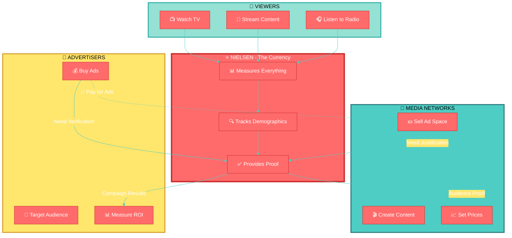

---

## Core Business Pillars

Here is a breakdown of Nielsen's core business pillars:

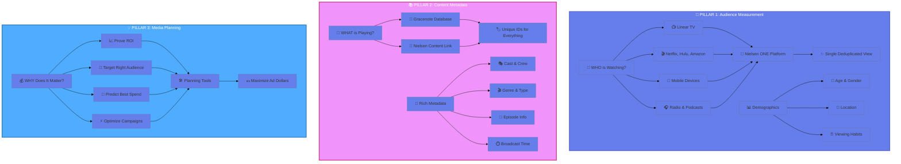

### 1. Audience Measurement (The "Who")

This is what the company is historically most famous for—the "Nielsen Ratings."

#### 🔍 How Nielsen Panels Actually Work

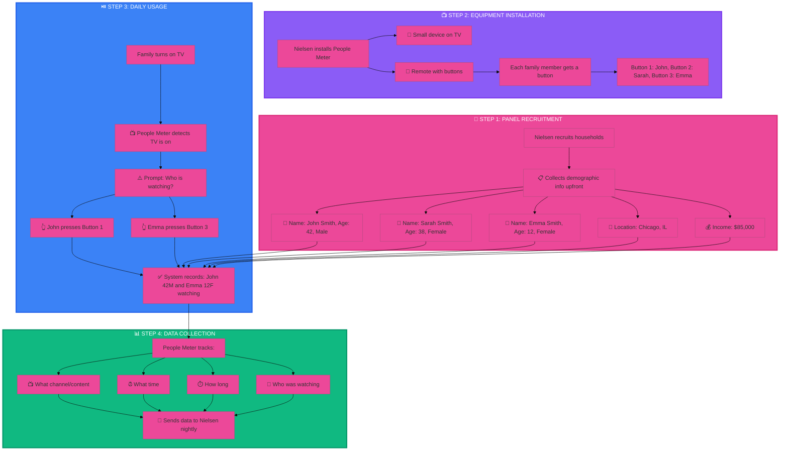

#### 📋 The Truth: No AI Cameras, Just Self-Reporting

**How Nielsen ACTUALLY knows your demographics:**

1. **Upfront Registration (One-Time Setup)**
   - When a household joins Nielsen's panel, they fill out detailed demographic surveys
   - Information collected:
     - 👤 Each household member's name, age, gender
     - 📍 Home address and location
     - 💰 Household income bracket
     - 🎓 Education level
     - 👨‍👩‍👧‍👦 Family composition
   - This data is stored in Nielsen's database and linked to that household's People Meter

2. **People Meter Device (The Hardware)**
   - Small electronic box installed near the TV
   - Detects when TV is on and what's playing
   - Has a remote control with numbered buttons
   - Each family member is assigned a button number
   - **NO cameras, NO facial recognition, NO AI detection**

3. **Active Participation (Daily Behavior)**
   - When someone starts watching TV, they press their assigned button
   - When they stop watching, they press it again
   - The People Meter prompts: "Who is watching?" if it detects the TV is on but no buttons are pressed
   - Family members are expected to honestly report their viewing

4. **Data Transmission**
   - The People Meter records:
     - Button 1 (John, 42, Male) watched NBC from 8:00-9:00 PM
     - Button 3 (Emma, 12, Female) watched Netflix from 7:30-8:30 PM
   - Data is automatically sent to Nielsen's servers via internet connection
   - Nielsen aggregates this with data from thousands of other panel households

---

#### 📺 How Nielsen Detects What Channel/Content Is Being Watched


#### 🔍 Detailed Explanation of Each Detection Method

### Method 1: Set-Top Box Integration (Legacy Method)

**How it works:**
- The People Meter physically connects to your cable/satellite box via a cable
- It reads the tuning data directly from the box
- The cable box always knows what channel it's tuned to (Channel 7, Channel 42, etc.)
- The People Meter captures this information in real-time

**Example:**
- You change channel to NBC (Channel 7)
- Cable box tunes to Channel 7
- People Meter reads: "Channel 7"
- Nielsen's database knows: Channel 7 in Chicago = NBC
- Combined with time data, Nielsen knows exactly what show was airing

**Limitations:**
- Only works with traditional cable/satellite
- Doesn't work with streaming services
- Requires physical connection to set-top box

---

### Method 2: Audio Watermarking (Primary Method Today)

**How it works:**
- TV networks embed inaudible digital codes into their broadcast audio
- These "watermarks" are like invisible barcodes in the sound
- The People Meter has a built-in microphone that constantly listens to the TV
- It detects these watermarks and decodes them

**What the watermark contains:**
- Network ID (NBC, CBS, ABC, etc.)
- Station ID (WMAQ Chicago)
- Date and timestamp
- Program ID (specific show/episode)

**Example:**
- NBC embeds watermark in "Sunday Night Football" audio
- Watermark code: `NBC-WMAQ-CHI-2024-04-24-20:00:00-SNF-S2024-W16`
- People Meter's microphone picks up this code
- Decodes it: NBC, Chicago station, April 24 2024, 8:00 PM, Sunday Night Football, Week 16
- ✅ Nielsen knows exactly what you're watching

**Advantages:**
- Works regardless of how you're watching (cable, antenna, streaming)
- Very accurate - down to the second
- Can't be fooled by channel surfing
- Works even if you're watching on a laptop near the People Meter

**How it's embedded:**
- Networks use special encoding equipment
- Watermark is added during broadcast
- Completely inaudible to humans (outside hearing range or masked by content)
- Doesn't affect audio quality

---

### Method 3: Audio Fingerprinting (Backup Method)

**How it works:**
- If no watermark is detected, the People Meter records a short audio sample
- Creates a unique "fingerprint" of that audio (like Shazam for TV)
- Sends the fingerprint to Nielsen's servers
- Nielsen's database has fingerprints of millions of TV shows, movies, and commercials
- Matches the fingerprint to identify the content

**Example:**
- You're watching a Friends rerun on a local station
- No watermark present (old content)
- People Meter records 10 seconds of audio
- Creates fingerprint: `A7F3B9C2E1D4...` (unique hash)
- Sends to Nielsen servers
- Nielsen matches: "Friends, Season 5, Episode 12, timestamp 14:32"
- ✅ Nielsen knows what you're watching

**Advantages:**
- Works with any content, even old shows without watermarks
- Works with DVDs, streaming, any source
- Very reliable for identification

**Limitations:**
- Requires internet connection to send fingerprints
- Slight delay in identification (few seconds)
- Requires Nielsen to have the content in their reference database

---

### Method 4: Smart TV ACR (Automatic Content Recognition)

**How it works:**
- Modern smart TVs (Samsung, LG, Vizio, etc.) have built-in ACR chips
- ACR analyzes both the video pixels and audio coming through the TV
- Creates a fingerprint and matches it against a database
- Reports viewing data directly to Nielsen (if you opted in)

**Example:**
- You're watching Netflix on your Samsung Smart TV
- Samsung's ACR chip analyzes what's on screen
- Identifies: "Stranger Things, Season 4, Episode 1, 23:45 into episode"
- Samsung sends this data to Nielsen (with your consent)
- Nielsen combines it with your TV registration demographics
- ✅ Nielsen knows what you're watching

**Advantages:**
- No additional hardware needed (built into TV)
- Works with any content source (cable, streaming, gaming, DVDs)
- Very accurate - can identify content frame-by-frame
- Captures streaming content that traditional methods miss

**Privacy Note:**
- You can opt-out of ACR in your TV settings
- Usually found under: Settings → Privacy → Viewing Information
- Different brands call it different things (Viewing Data, Content Recognition, etc.)

---

#### 🔄 How These Methods Work Together

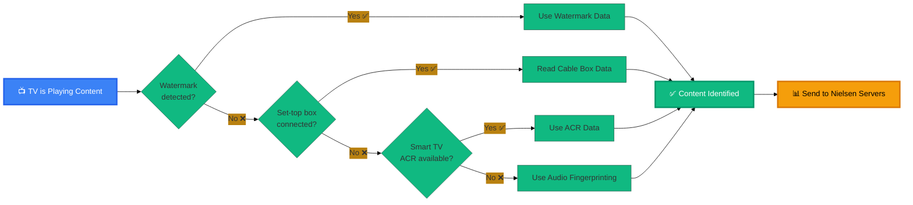

**Nielsen uses a "waterfall" approach:**
1. First, try to detect audio watermark (fastest, most accurate)
2. If no watermark, check set-top box connection
3. If no set-top box, use Smart TV ACR
4. If all else fails, use audio fingerprinting

This ensures Nielsen can identify content no matter how you're watching!

---

#### 🎯 Real-World Example: Your Evening Viewing

**Scenario:** You watch TV from 7:00 PM to 10:00 PM

| Time | What You Watch | How Nielsen Detects It |
|------|----------------|------------------------|
| 7:00-7:30 PM | Local news on NBC (cable) | Audio watermark from NBC broadcast |
| 7:30-8:30 PM | Netflix: Stranger Things | Smart TV ACR identifies Netflix content |
| 8:30-9:00 PM | YouTube on TV | Audio fingerprinting matches video content |
| 9:00-10:00 PM | HBO on cable | Audio watermark from HBO broadcast |

**Result:** Nielsen knows:
- You watched 30 min of NBC news
- 60 min of Netflix (specific show and episode)
- 30 min of YouTube
- 60 min of HBO

Combined with your demographic data (age, gender, location), this becomes part of the Nielsen ratings!

---

#### 🎯 Modern Enhancements: Automatic Content Recognition (ACR)

For newer measurement methods, Nielsen also uses:

**Smart TV Data (No Panel Required):**
- Many smart TVs have built-in ACR (Automatic Content Recognition) technology
- ACR "listens" to the audio fingerprint of what's playing and identifies the content
- **But demographics?** Smart TV manufacturers collect this during TV registration:
  - When you set up your Samsung/LG/Vizio TV, you enter your ZIP code, age, etc.
  - If you opt-in to data sharing, this demographic info is linked to your viewing data
  - Still NO cameras - just the registration info you provided

**Mobile/Streaming Measurement:**
- Nielsen partners with apps (Netflix, Hulu, etc.) to get viewing data
- Demographics come from your account profile:
  - Your Netflix account knows your age (from credit card/registration)
  - Your location (from IP address or account settings)
  - Gender (from account profile if provided)

#### ❌ What Nielsen Does NOT Do

- ❌ No cameras watching you
- ❌ No facial recognition
- ❌ No AI detecting who's in the room
- ❌ No microphones listening to conversations
- ❌ No tracking your physical movements

#### ✅ What Nielsen DOES Do

- ✅ Relies on self-reported demographics (panel members)
- ✅ Uses account registration data (streaming services)
- ✅ Tracks device usage (what's playing, when, how long)
- ✅ Combines panel data with big data from smart TVs and streaming platforms
- ✅ Uses statistical modeling to extrapolate from panel to general population

#### 🔒 Privacy Considerations

- Panel participation is **voluntary** and **compensated** (Nielsen pays panel members)
- Panel members **consent** to having their viewing tracked
- Data is **anonymized** before being sold to clients
- Nielsen reports aggregate statistics, not individual viewing habits
- Strict privacy policies and regulatory compliance (GDPR, CCPA, etc.)

---

**Bottom Line:** Nielsen knows your age, gender, and location because **you told them** (either directly as a panel member or through your account registration with streaming services). There's no creepy AI surveillance - just good old-fashioned surveys combined with modern device tracking technology.

---

- **Cross-Media Tracking**: Nielsen measures how many people are watching, listening, and engaging with content across traditional linear TV, streaming platforms (like Netflix, Amazon, and Hulu), digital devices, and radio.

- **Demographic Insights**: They don't just count glowing screens; they use heavily calibrated panels of real people combined with massive data sets to determine exactly who is watching (age, gender, location, habits).

- **Nielsen ONE**: This is their modern, flagship measurement platform. It is designed to provide a single, deduplicated view of an audience. It ensures that if someone watches half a show on their smart TV and finishes it on their smartphone, they are counted accurately as one viewer, not two.

### 2. Content Metadata (The "What")

To measure viewership accurately, the system needs to know exactly what is playing at any given microsecond. This is the foundation of divisions like Gracenote and the systems powered by the Nielsen Content Link (NCL).

- **Categorizing the Media Universe**: Nielsen maintains massive, globally synchronized databases of TV shows, movies, live sports, and music.

- **Standardization**: They assign unique identifiers and rich metadata (cast, genre, episode descriptions, broadcast time) to content. This allows networks, streaming services, and cable providers to organize their platforms, power their recommendation algorithms, and feed accurate data into the measurement pipelines.

#### How Nielsen's Metadata Powers the Industry

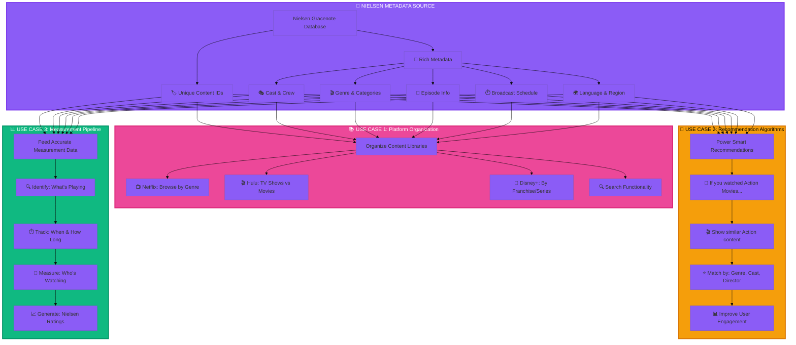

**Breaking it down:**

1. **Organize Platforms** 🗂️
   - When you open Netflix and see "Action Movies," "Comedies," or "Documentaries," that categorization comes from Nielsen's metadata
   - Cable providers use it to build their on-screen TV guides showing what's playing on each channel
   - Streaming services use it to separate TV shows from movies, organize by season/episode, and create browsable collections

2. **Power Recommendation Algorithms** 🎯
   - When Netflix suggests "Because you watched Stranger Things, try The Umbrella Academy," it's using Nielsen's metadata about genre, cast, themes, and viewer patterns
   - The algorithm knows both shows are sci-fi, have similar target demographics, and feature ensemble casts—all thanks to Nielsen's rich metadata
   - This keeps viewers engaged and watching more content

3. **Feed Accurate Data into Measurement Pipelines** 📊
   - For Nielsen to measure viewership, it needs to know exactly what content is playing at every moment
   - When someone watches "Friends S01E01" on their smart TV, Nielsen's metadata identifies it instantly using unique IDs
   - This ensures accurate counting: the system knows it's the same show whether watched on cable, Netflix, or HBO Max
   - Without this standardization, Nielsen couldn't deduplicate viewers or generate accurate ratings across platforms

### 3. Media Planning & Marketing Optimization (The "Why It Matters")

Nielsen takes all of this measurement and metadata and turns it into software and analytics tools for the people spending the money.

- **Proving ROI**: Advertisers use Nielsen data to see if their ad campaigns actually worked. Did the ads reach the target audience? Did they drive actual business outcomes?

- **Predictive Planning**: Media buyers use Nielsen's software to simulate where they should spend their marketing budgets next quarter to get the best return on investment.

---

## The Nielsen Data Flow

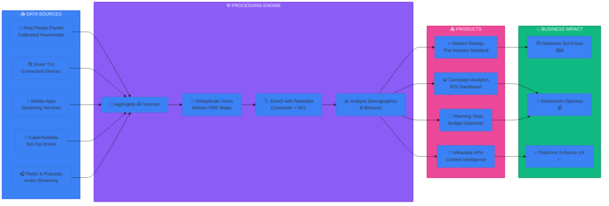

---

## The Business Model: How Nielsen Makes Money

Nielsen is a B2B (business-to-business) data and analytics company. They do not make money from the everyday consumers watching TV. Instead, they generate revenue primarily through subscriptions and data licensing:

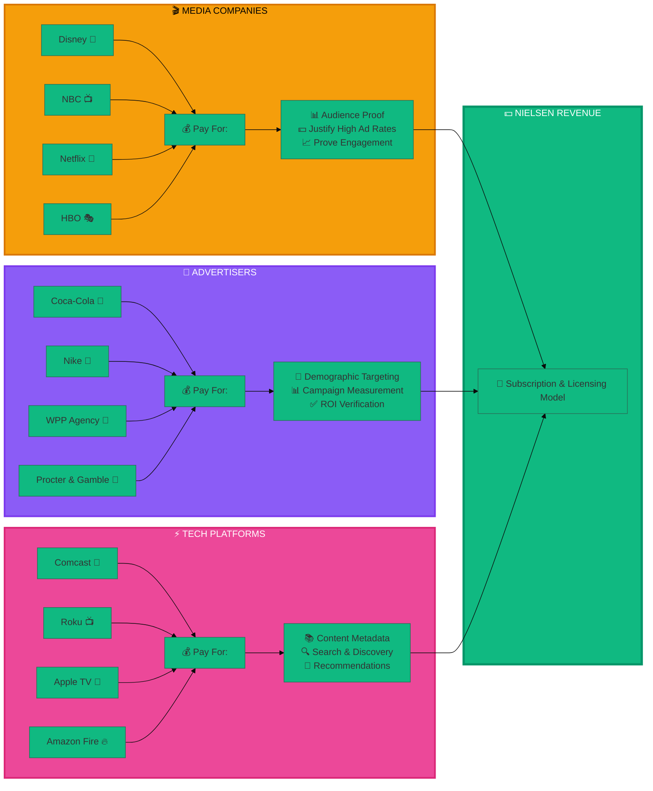

- **Media Companies & Networks** (Disney, NBC, Netflix) pay Nielsen to officially prove they have large, highly engaged audiences so they can justify charging high rates to advertisers.

#### How Media Companies Use Nielsen to Justify Ad Pricing

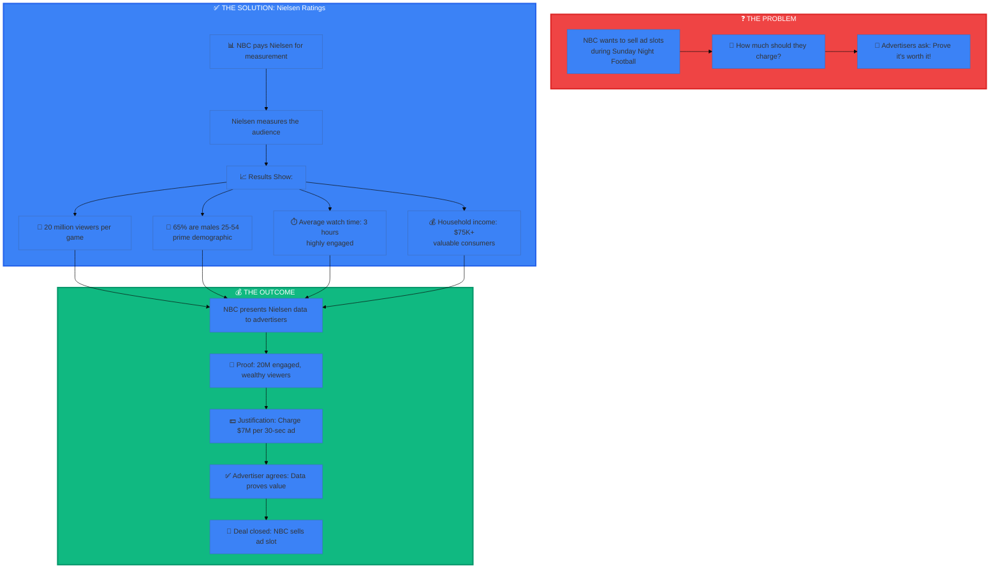

**The Complete Picture:**

**Without Nielsen:**
- NBC: "Our show is really popular! Pay us $7 million for a 30-second ad."
- Advertiser: "How do I know? Prove it!"
- NBC: "Trust us?" 🤷
- Advertiser: "No deal." ❌

**With Nielsen:**
- NBC: "Nielsen measured 20 million viewers, 65% are your target demographic, they watch for 3 hours straight."
- Advertiser: "Nielsen is the industry standard. That's solid proof. Here's $7 million." ✅

**Why This Matters:**

1. **Third-Party Credibility** 🏆
   - Nielsen is independent and trusted by the entire industry
   - Networks can't just make up their own numbers
   - Advertisers trust Nielsen's methodology and data

2. **Detailed Audience Breakdown** 📊
   - Not just "how many" but "who exactly"
   - Age, gender, income, location, viewing habits
   - Helps networks charge premium rates for valuable demographics

3. **Competitive Pricing** 💵
   - NBC can compare their ratings to CBS, ABC, Fox
   - "Our show has 20M viewers, theirs has 15M, so we charge more"
   - Creates a fair marketplace based on data

4. **Engagement Metrics** ⏱️
   - Nielsen tracks if people actually watch or just have TV on
   - Shows with highly engaged audiences command higher ad rates
   - Proves viewers aren't skipping commercials or leaving the room

**Real Example:**
- **Super Bowl 2024**: NBC charged $7 million per 30-second ad
- **Why?** Nielsen proved 115 million viewers watched, with high engagement throughout
- **Result**: Advertisers paid because Nielsen data justified the astronomical price
- **NBC's Investment**: They pay Nielsen millions annually for this measurement service, but it enables them to charge billions in ad revenue

- **Advertisers & Ad Agencies** (Coca-Cola, WPP) pay Nielsen to ensure their ads are reaching the right demographics and to measure the ultimate success of their campaigns.

- **Tech Platforms & Distributors** (Comcast, Roku, Apple) pay for Nielsen's metadata to power their on-screen TV guides, search functions, and content algorithms.

#### How Tech Platforms Use Nielsen's Metadata

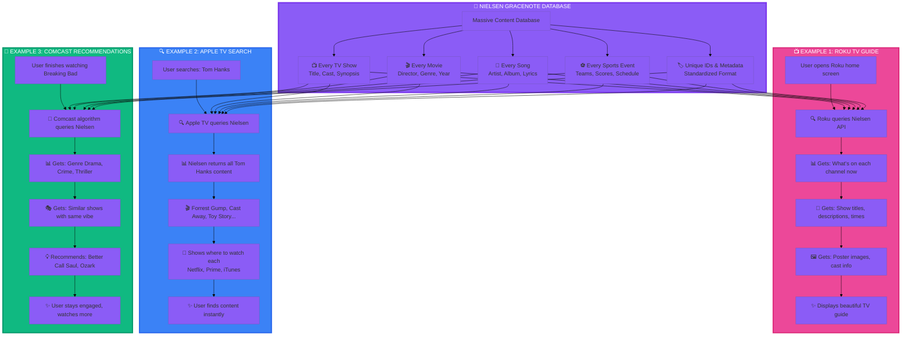

**Real-World Examples:**

### 1. 📺 Roku TV Guide - "What's On Now"

**The User Experience:**
- You turn on your Roku TV
- You see a beautiful grid showing what's playing on 200+ channels
- Each show has a title, description, cast list, and poster image
- You can see what's coming up next on each channel

**Behind the Scenes:**
- Roku doesn't manually track every show on every channel
- Instead, Roku pays Nielsen for API access
- Every second, Roku queries: "What's playing on Channel 7 at 8:03 PM?"
- Nielsen instantly responds: "Friends, Season 5 Episode 12, 'The One with Chandler's Work Laugh'"
- Nielsen also provides: cast (Jennifer Aniston, Courteney Cox), synopsis, episode thumbnail
- Roku displays this beautifully formatted data to you

**Without Nielsen:** Roku would need to manually track thousands of channels, millions of shows, and constantly update everything. Impossible!

### 2. 🔍 Apple TV Universal Search - "Find Anything, Anywhere"

**The User Experience:**
- You open Apple TV and search "Dune"
- Instantly see: Dune (2021) with poster, cast, synopsis, ratings
- Shows where it's available: HBO Max, iTunes, Amazon Prime

**Behind the Scenes:**
- Apple TV uses Nielsen/Gracenote metadata to identify the content: "Dune (2021), directed by Denis Villeneuve, starring Timothée Chalamet..."
- Nielsen provides: Official title, cast, crew, synopsis, genre, poster images, unique content ID
- Apple then checks its streaming partner integrations to see which services have it
- Nielsen's standardized content IDs help Apple match the same movie across different platforms

**The Key Role of Nielsen:**
- **Content Identification**: When you type "Dune," Nielsen's database helps Apple understand you mean the 2021 movie (not the 1984 version or the book)
- **Rich Metadata**: Nielsen provides all the details - cast, synopsis, ratings, images - that make the search result useful
- **Standardization**: Nielsen assigns unique IDs, so Apple knows "Dune on HBO Max" and "Dune on iTunes" are the same movie
- **Comprehensive Catalog**: Nielsen tracks millions of titles, so Apple can search across everything, not just what's currently streaming

**Without Nielsen:** 
- Apple would need to manually catalog every movie and TV show
- Different streaming services might list the same content with slightly different titles or metadata
- Harder to provide rich search results with cast info, images, and descriptions
- More difficult to match the same content across multiple platforms

**Important Note:** Apple TV also needs direct partnerships with streaming services (Netflix, HBO Max, etc.) to know real-time availability and pricing. Nielsen provides the content intelligence layer, while streaming partnerships provide the availability layer.

### 3. 🎯 Comcast Xfinity Recommendations - "You Might Also Like"

**The User Experience:**
- You finish watching "Stranger Things" on Netflix through your Comcast cable box
- Comcast suggests: "The Umbrella Academy," "Dark," "The OA"
- All are sci-fi shows with similar themes and target audience

**Behind the Scenes:**
- Comcast's algorithm queries Nielsen: "What shows are similar to Stranger Things?"
- Nielsen provides metadata: Genre (sci-fi, horror, drama), themes (supernatural, 1980s nostalgia), target demographic (18-34)
- Nielsen also provides: Shows with similar metadata profiles
- Comcast's algorithm uses this to recommend content you'll likely enjoy

**Without Nielsen:** Comcast would need to manually categorize millions of shows and constantly update as new content releases.

---

**Why Tech Platforms Pay Nielsen:**

1. **Saves Massive Engineering Effort** 💻
   - Building and maintaining a global content database would cost hundreds of millions
   - Nielsen already did this work over decades
   - Cheaper to license than build in-house

2. **Always Up-to-Date** 🔄
   - New shows, movies, and episodes release daily
   - Nielsen updates their database in real-time
   - Platforms get instant access to latest content info

3. **Standardized Format** 📋
   - Nielsen provides data in consistent, structured format
   - Easy to integrate into any platform's systems
   - No need to parse different formats from different sources

4. **Global Coverage** 🌍
   - Nielsen tracks content across 100+ countries
   - Multiple languages, regional variations
   - One API call gets worldwide content data

**The Business Model:**
- Roku pays Nielsen an annual licensing fee (estimated $10-50M)
- In return, Roku gets unlimited API access to Nielsen's entire database
- This enables Roku to provide a premium user experience that keeps customers happy
- Happy customers = more device sales and ad revenue for Roku


---

## 🎯 Understanding Your Role in Nielsen's Business

### Business Unit: Audience Measurement (10000001)
### Department: Lineups, Metadata, Reference & Back Office (30000351)

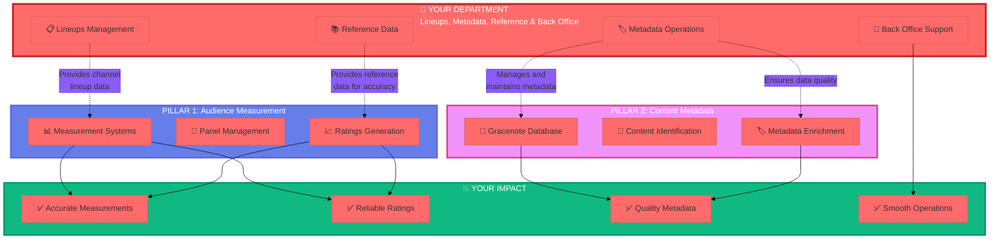

### Your Department's Critical Role

You work at the **foundation** that makes both Pillar 1 (Audience Measurement) and Pillar 2 (Content Metadata) possible. Here's how:

#### 📋 Lineups Management
**What it is:** Managing the channel lineups - knowing which channels are available in which markets, on which cable/satellite providers, and what content airs when.

**Why it matters:**
- **For Audience Measurement**: Nielsen can't measure viewership accurately without knowing what channels exist and what's playing on them
- **Example**: If Comcast in Chicago carries NBC on Channel 5, but Comcast in New York has NBC on Channel 4, your team tracks this
- **Impact**: Ensures measurement systems know exactly what content viewers are watching in each market

#### 🏷️ Metadata Operations
**What it is:** Managing, maintaining, and ensuring quality of content metadata - the detailed information about every TV show, movie, and program.

**Why it matters:**
- **For Content Metadata Pillar**: You're directly maintaining the Gracenote/Nielsen database that powers the entire industry
- **For Audience Measurement**: Accurate metadata ensures measurement systems correctly identify what's being watched
- **Example**: When "Friends" airs, your metadata ensures it's tagged with correct episode number, cast, genre, etc.
- **Impact**: Powers TV guides, search functions, recommendations, AND accurate measurement

#### 📚 Reference Data
**What it is:** Maintaining the master reference datasets that other systems rely on - station IDs, market definitions, demographic categories, etc.

**Why it matters:**
- **For Audience Measurement**: Provides the standardized reference points for all measurements
- **Example**: Defining what constitutes the "New York DMA (Designated Market Area)" or standardizing age brackets (18-34, 35-49, etc.)
- **Impact**: Ensures consistency and accuracy across all Nielsen products

#### 🔧 Back Office Support
**What it is:** The operational backbone that keeps everything running smoothly - data quality checks, system maintenance, issue resolution.

**Why it matters:**
- **For Everything**: Without solid back office operations, the entire measurement and metadata ecosystem breaks down
- **Example**: Catching and fixing data errors before they impact client-facing ratings
- **Impact**: Maintains Nielsen's reputation for accuracy and reliability

---

### 🎯 Your Position in the Value Chain

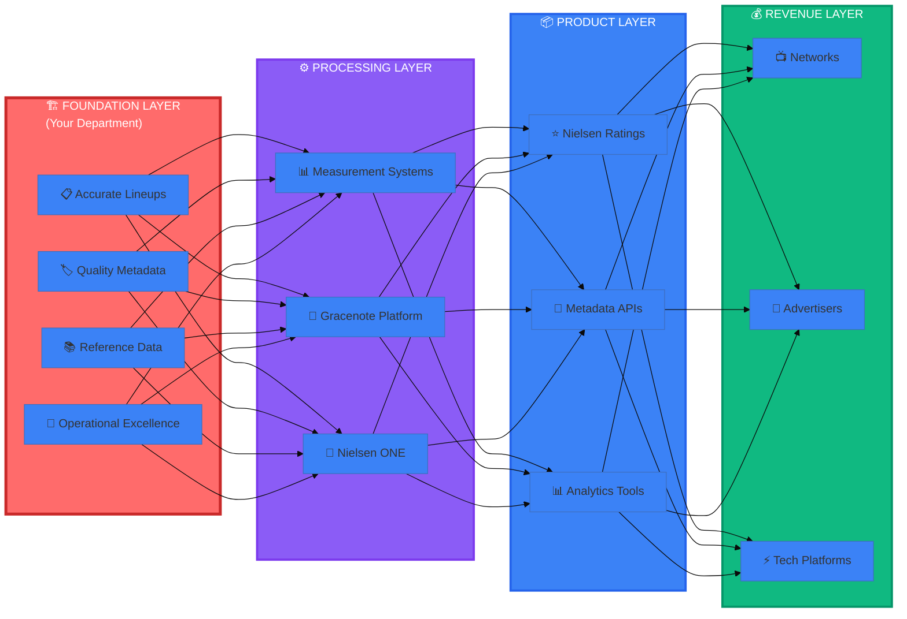

**Bottom Line:** You're in the **Foundation Layer**. Without accurate lineups, quality metadata, and solid reference data from your department, Nielsen's entire business - the ratings, the metadata products, the analytics - would collapse. You're not just supporting one pillar; you're the bedrock that both Pillar 1 and Pillar 2 are built upon.

**Your work enables:**
- 📺 Networks to charge billions in ad revenue (backed by accurate ratings)
- 🎯 Advertisers to optimize their campaigns (using reliable measurement)
- ⚡ Tech platforms to provide great user experiences (powered by quality metadata)


---

## 🎈 Explain It Like I'm 10: How Does Nielsen Know What You're Watching?

### The Simple Version

Imagine Nielsen is like a **detective** trying to figure out what TV shows are popular. But instead of watching everyone's TV (that would be creepy!), they use some clever tricks.

---

### 🎵 The Magic Box That Listens

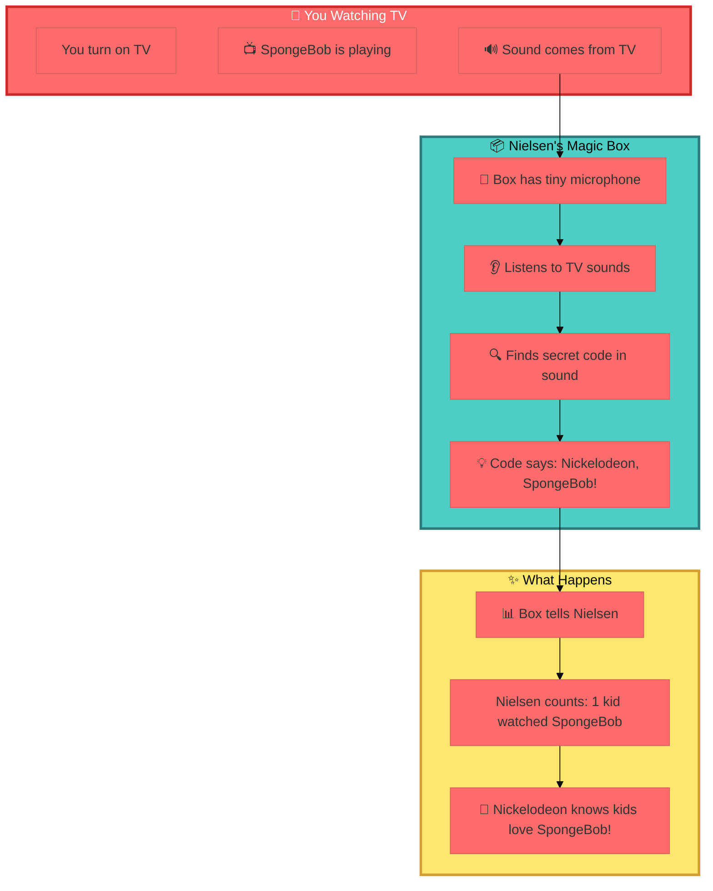

---

### 🎮 Think of It Like This...

#### Method 1: Secret Codes (Audio Watermarks)

**It's like invisible ink on TV!**

- When TV shows are made, they hide a **secret code** in the sound
- You can't hear it (it's like a dog whistle - too high or too low for human ears)
- Nielsen's box has special "ears" that CAN hear these codes
- The code is like a name tag that says: "Hi! I'm SpongeBob on Nickelodeon!"

**Example:**
```
What you hear: "I'm ready! I'm ready!" (SpongeBob's voice)
What Nielsen's box hears: "NICKELODEON-SPONGEBOB-S12-E05-2024-04-24-16:00"
```

It's like when your mom writes your name on your lunch box so everyone knows it's yours!

---

#### Method 2: Sound Detective (Audio Fingerprinting)

**It's like Shazam for TV!**

You know how Shazam can listen to a song and tell you what it is? Nielsen does the same thing with TV shows!

1. 📺 You're watching a show
2. 🎵 Nielsen's box records a tiny bit of the sound (like 5 seconds)
3. 🔍 It creates a "fingerprint" - a special pattern of that sound
4. 📤 Sends it to Nielsen's computer
5. 🎯 Nielsen's computer says: "That's Friends, Season 5, Episode 12!"

**Just like:**
- Your fingerprint is unique to you
- Every TV show has a unique sound fingerprint
- Nielsen can match it to figure out what show it is

---

#### Method 3: Smart TV Magic (ACR)

**Your TV is smarter than you think!**

Modern TVs are like smartphones - they have tiny computers inside. These computers can:
- 👀 "Look" at what's on the screen
- 👂 "Listen" to the sound
- 🧠 Figure out: "Oh, this is Minecraft on YouTube!"
- 📱 Tell Nielsen what you're watching

**It's like:**
- When you take a photo and your phone says "This is a dog!"
- Your TV can "see" what's playing and say "This is Stranger Things!"

---

### 🎯 The Complete Story

**Step 1: Nielsen Asks Families to Help**
- Nielsen asks: "Hey, can we put a small box near your TV?"
- Families say: "Sure! Will you pay us?" 
- Nielsen says: "Yes! Here's some money!"

**Step 2: The Box Listens**
- The box sits near your TV
- It has a tiny microphone (like your phone)
- It listens to what's playing on TV
- **Important:** It ONLY listens to the TV, not to you talking!

**Step 3: Finding the Secret Code**
- Most TV shows have secret codes hidden in the sound
- The box finds these codes
- The code tells Nielsen: what show, what channel, what time

**Step 4: If There's No Code**
- Sometimes old shows don't have codes
- The box records a bit of sound
- Sends it to Nielsen's computer
- Computer matches it like Shazam

**Step 5: Counting Everyone**
- Nielsen has boxes in thousands of homes
- They count: "1,000 kids watched SpongeBob today!"
- They tell Nickelodeon: "SpongeBob is super popular!"
- Nickelodeon makes more SpongeBob episodes! 🎉

---

### 🤔 Questions Kids Usually Ask

**Q: Is Nielsen watching me through a camera?**
**A:** Nope! No cameras at all. The box only listens to your TV's sound, not you.

**Q: Can the box hear me talking?**
**A:** Technically yes, but it doesn't care! It's only looking for secret TV codes. It ignores everything else.

**Q: Why do they need to know what I watch?**
**A:** So TV channels know what shows kids like! If lots of kids watch a show, they make more episodes.

**Q: Do I have to press a button?**
**A:** Yes! When you start watching, you press your special button so Nielsen knows YOU are watching (not your mom or dad).

**Q: What if I forget to press the button?**
**A:** The box will remind you! It shows a message: "Who's watching?" 

**Q: Can I trick the box?**
**A:** You could, but why? Nielsen is trying to help make better TV shows for kids like you!

---

### 🎨 Fun Analogy: The Classroom Voting System

Imagine your teacher wants to know what game the class likes most:

**Old Way (Impossible):**
- Teacher watches every kid at recess
- Tries to remember who played what
- Gets tired and confused

**Nielsen's Way (Smart):**
- Teacher gives each kid a clicker
- When you play soccer, click Button 1
- When you play tag, click Button 2
- At the end of the day, teacher counts: "15 kids played soccer, 10 played tag!"
- Next week, teacher brings more soccer balls because that's what kids like!

That's exactly what Nielsen does with TV! They count what people watch so TV channels can make shows people actually want to see.

---

### 🌟 The Bottom Line (Kid Version)

**Nielsen = TV Show Vote Counter**

- They have a magic box that listens to your TV
- The box finds secret codes in TV shows
- They count how many people watch each show
- TV channels use this to make shows you'll love!

**And the best part?** Families get paid to help Nielsen! It's like getting an allowance for watching TV! 📺💰

