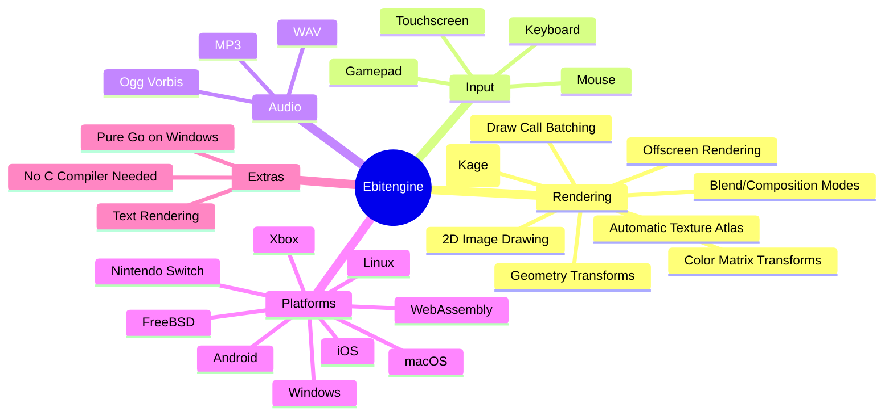
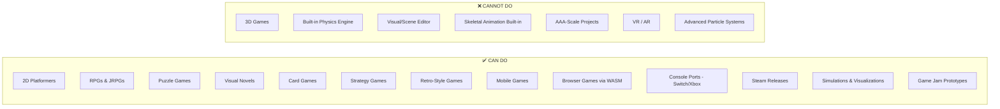
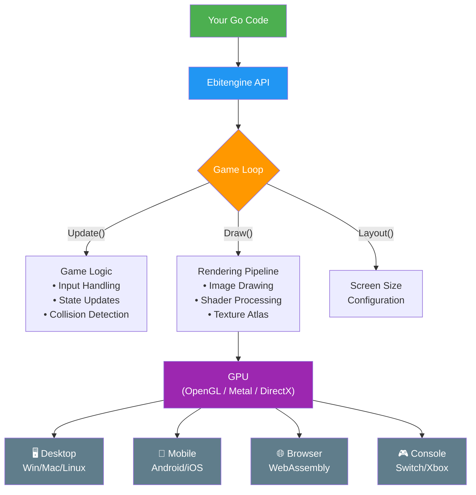
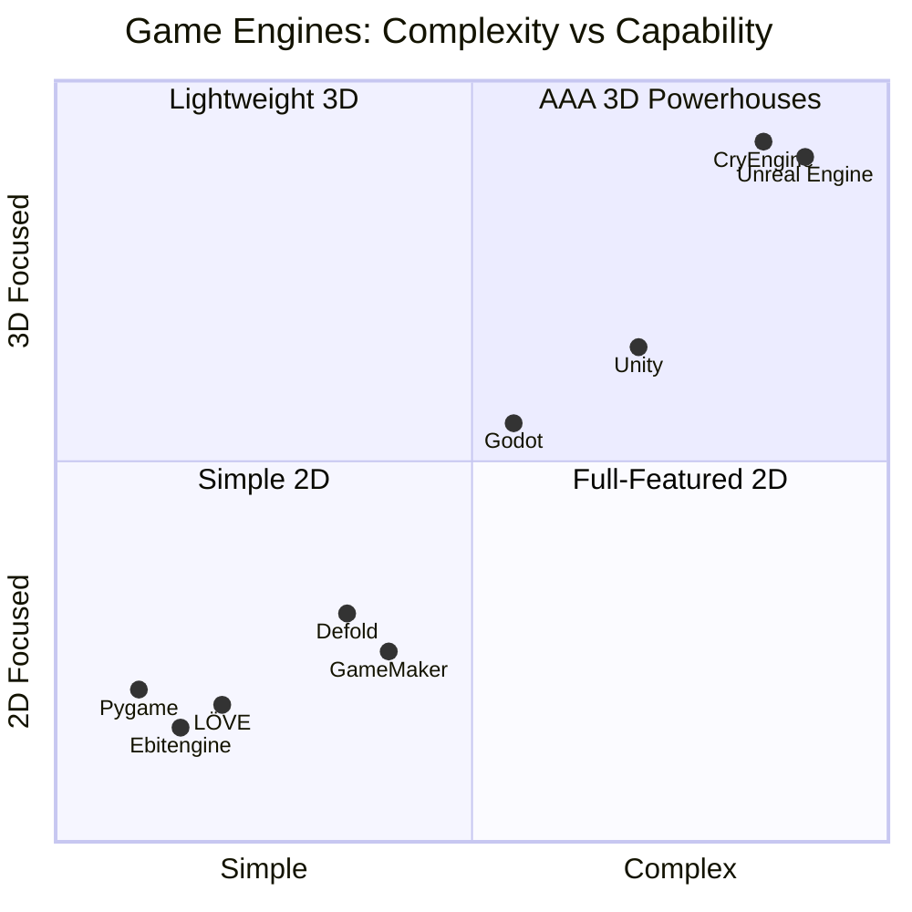
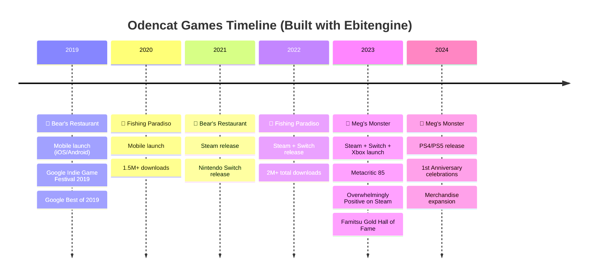
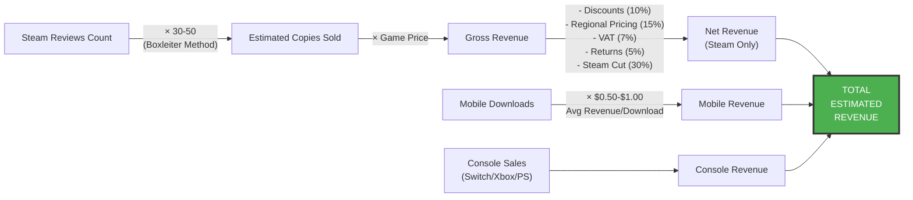
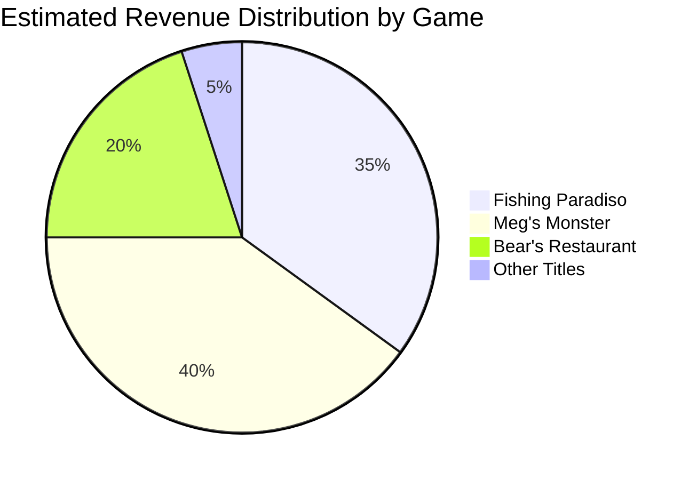
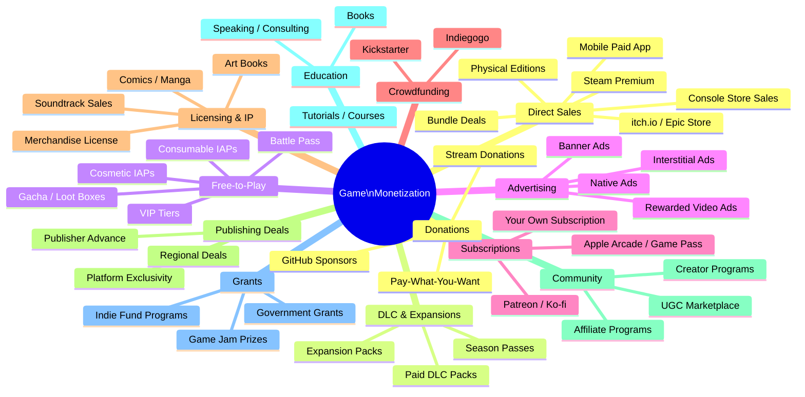
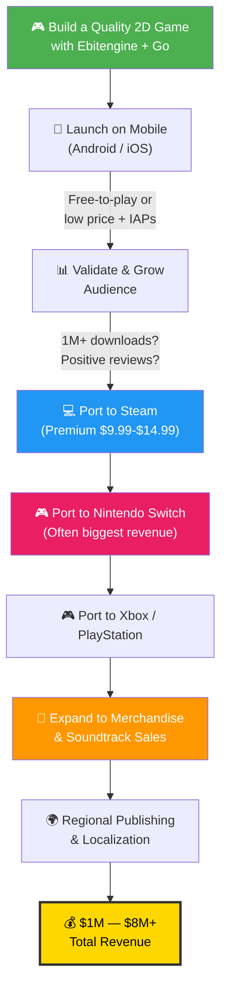

# 🎮 Ebitengine — The Complete Guide

> *"A dead simple 2D game engine for Go"* — [ebitengine.org](https://ebitengine.org)

---

## 📖 What is Ebitengine?

Ebitengine (formerly "Ebiten") is an **open-source 2D game engine/library** for the Go programming language, created by **Hajime Hoshi**. It has been in active development for **11+ years** and is licensed under **Apache 2.0**.

Unlike heavyweight engines with complex editors and asset pipelines, Ebitengine is a **code-first library** — you write Go and get a game loop, rendering, and input handling out of the box. Everything in Ebitengine is an `Image`: the screen, sprites, offscreen buffers — all rendered by drawing one image on top of another.

```
┌─────────────────────────────────────────────────────┐
│                   EBITENGINE                         │
│                                                     │
│   Language: Go          License: Apache 2.0         │
│   Type: 2D Game Engine  Stars: 11.9k+ (GitHub)      │
│   Creator: Hajime Hoshi Since: 2013                 │
│                                                     │
│   "Everything is an Image"                          │
└─────────────────────────────────────────────────────┘
```

---

## ⚙️ Features of Ebitengine



### Feature Highlights at a Glance

| Category | Details |
|:---------|:--------|
| 🎨 Rendering | Image-on-image drawing, geometry/color matrix transforms, custom fragment shaders (Kage language) |
| 🖱️ Input | Mouse, keyboard, gamepad, touchscreen |
| 🔊 Audio | WAV, Ogg Vorbis, MP3 playback |
| ⚡ Performance | Automatic texture atlas, draw call batching, GPU-accelerated |
| 🌍 Platforms | Windows, macOS, Linux, FreeBSD, Android, iOS, WebAssembly, Nintendo Switch, Xbox |
| 📝 Text | Built-in text rendering |
| 🔧 Dev Experience | Pure Go on Windows (no C compiler needed), simple API |

---

## ✅ What Can Be Achieved vs ❌ What Cannot




### Detailed Comparison

| Capability | Status | Notes |
|:-----------|:------:|:------|
| 2D games (all genres) | ✅ | Platformers, RPGs, puzzles, visual novels, card games, strategy |
| Mobile deployment (Android/iOS) | ✅ | Production-proven with millions of downloads |
| Browser games (WebAssembly) | ✅ | Compile to WASM and run in any modern browser |
| Console ports (Switch, Xbox) | ✅ | Requires dev kits; proven by Odencat |
| Steam releases | ✅ | Official guide available on ebitengine.org |
| Custom shaders | ✅ | Kage shading language |
| 3D rendering | ❌ | No 3D pipeline, meshes, or 3D physics |
| Built-in physics engine | ❌ | Roll your own or use community libraries |
| Visual/scene editor | ❌ | Code-only, no drag-and-drop GUI |
| Skeletal animation | ❌ | Not built-in (community libs exist) |
| AAA-scale production | ❌ | Not designed for large teams or massive pipelines |
| VR / AR | ❌ | No support |

---

## 🏗️ Ebitengine Architecture



---

## 🌍 Game Engines Landscape — Comparison



### Engine-by-Engine Breakdown

| Engine | Language | Best For | Pricing | Well-Known Games |
|:-------|:---------|:---------|:--------|:-----------------|
| 🟢 **Unity** | C# | Mobile, indie, VR/AR | Free tier + revenue share | Hollow Knight, Cuphead, Celeste, Among Us, Pokémon Go, Genshin Impact |
| 🔵 **Unreal Engine** | C++ / Blueprints | AAA 3D, photorealism | Free until $1M, then 5% royalty | Fortnite, FF VII Remake, Hogwarts Legacy, Rocket League |
| 🟣 **Godot** | GDScript / C# | Open-source, 2D & growing 3D | 100% Free | Dome Keeper, Cassette Beasts, Brotato, Sonic Colors Ultimate |
| 🟡 **GameMaker** | GML | 2D, beginner-friendly | Free tier + paid plans | Undertale, Hotline Miami, Hyper Light Drifter, Katana ZERO |
| 🔴 **RPG Maker** | Ruby / JS | JRPG-specific | One-time purchase | To the Moon, Corpse Party, OneShot |
| 🟤 **Defold** | Lua | Mobile 2D | Free | Family Island, Melvor Idle |
| ⚪ **Cocos2d-x** | C++ / Lua / JS | Mobile 2D | Free | Badland, Geometry Dash |
| 🟠 **LÖVE** | Lua | 2D, lightweight | Free | Balatro, Move or Die |
| 🔵 **CryEngine** | C++ / Lua | High-end 3D | Free until $5K/yr revenue | Crysis series, Hunt: Showdown |
| 🟢 **Ebitengine** | Go | Simple 2D, cross-platform | Free (Apache 2.0) | Bear's Restaurant, Meg's Monster, Fishing Paradiso |

---

## 🎯 Commercial Games Built with Ebitengine

All major commercial Ebitengine titles come from **Odencat**, the Japanese indie studio founded by **Daigo Sato**.




### Game Details

#### 🐻 Bear's Restaurant
```
╔══════════════════════════════════════════════════════════╗
║  BEAR'S RESTAURANT                                      ║
║  Genre: Adventure / Narrative                            ║
║  Platforms: iOS, Android, Steam, Nintendo Switch         ║
║  Downloads: 1,500,000+ (mobile)                          ║
║  Steam Price: $12.99                                     ║
║  Awards: Google Indie Game Festival 2019                 ║
║          Google Best of 2019                             ║
║  eShop: Hit #19 on Best Sellers                          ║
╚══════════════════════════════════════════════════════════╝
```

#### 🎣 Fishing Paradiso
```
╔══════════════════════════════════════════════════════════╗
║  FISHING PARADISO                                        ║
║  Genre: Fishing RPG / Narrative                          ║
║  Platforms: iOS, Android, Steam, Nintendo Switch         ║
║  Downloads: 2,000,000+ (mobile)                          ║
║  Steam Price: $9.99                                      ║
║  Highlight: Most downloaded Ebitengine game ever         ║
╚══════════════════════════════════════════════════════════╝
```

#### 👹 Meg's Monster
```
╔══════════════════════════════════════════════════════════╗
║  MEG'S MONSTER                                           ║
║  Genre: JRPG / Story-Driven                              ║
║  Platforms: Steam, Switch, Xbox One, PS4, PS5            ║
║  Steam Price: $14.99                                     ║
║  Metacritic: 85                                          ║
║  Steam Rating: Overwhelmingly Positive                   ║
║  Famitsu: Gold Hall of Fame (32 points)                  ║
║  Awards: RPGamer Michael A. Memorial Award               ║
║          Tencent GWB Positive Legacy Award               ║
║          DreamHack Beyond - Best Music Nomination        ║
║  Odencat's first dedicated console/PC title              ║
╚══════════════════════════════════════════════════════════╝
```

---

## 💰 Ebitengine Commercial Game Revenue (Estimates)

> ⚠️ Odencat is a private company and has not publicly disclosed exact revenue figures. The following are **educated estimates** based on download counts, Steam review data (Boxleiter method), and industry benchmarks.

### Revenue Estimation Methodology



### Per-Game Revenue Estimates



| Game | Mobile Revenue | Steam Revenue | Console Revenue | Merch & Other | Total Estimate |
|:-----|:--------------|:-------------|:---------------|:-------------|:--------------|
| 🎣 Fishing Paradiso | $1M – $2M (2M+ downloads) | $100K – $200K | $200K – $500K | — | **$1M – $3M** |
| 🐻 Bear's Restaurant | $500K – $1M (1.5M+ downloads) | $150K – $300K (~683 reviews) | $200K – $400K (#19 eShop) | — | **$500K – $1.5M** |
| 👹 Meg's Monster | — (console-first) | $400K – $750K (~1,500+ reviews) | $500K – $1.5M (Switch+Xbox+PS) | $50K – $100K | **$1M – $3M+** |
| **TOTAL** | | | | | **$3M – $8M+** |

### Revenue Breakdown Visualization

```
    ESTIMATED TOTAL REVENUE: $3M — $8M+
    ═══════════════════════════════════════

    Fishing Paradiso  ████████████████████████████████░░░░  $1M-$3M
    Meg's Monster     ████████████████████████████████░░░░  $1M-$3M+
    Bear's Restaurant ██████████████████░░░░░░░░░░░░░░░░░░  $500K-$1.5M
    Other Titles      ████░░░░░░░░░░░░░░░░░░░░░░░░░░░░░░░░  Unknown

    Revenue Sources:
    📱 Mobile (IAP + Ads)     ████████████████████  ~40-50%
    🎮 Console (Switch/Xbox)  ████████████████      ~30-35%
    💻 Steam (PC)             ████████              ~15-20%
    🧸 Merchandise            ██                    ~3-5%
```

### Key Revenue Factors

- **Nintendo Switch** often outsells Steam for indie JRPGs — console revenue is likely the largest chunk for Meg's Monster
- **Mobile revenue** at 2M+ downloads (Fishing Paradiso) can be substantial even with free-to-play models
- **Merchandise** (plush toys, T-shirts, mugs via FangamerJP) adds incremental but meaningful revenue
- **Soundtrack sales** on Spotify, Apple Music, iTunes, and Steam DLC provide passive income
- **Multi-platform releases** multiply revenue — each new platform (PS4/PS5 added in 2024) opens a new audience

---

## 🌟 Ebitengine Success Stories

```mermaid
journey
    title Odencat's Journey — From Solo Dev to Multi-Platform Studio
    section The Beginning
      Daigo leaves corporate job in SF: 3: Daigo
      Goes indie at age 30+: 2: Daigo
      Starts building games in Go: 4: Daigo
    section First Success
      Bear's Restaurant mobile launch: 5: Odencat
      1.5M downloads: 5: Odencat
      Google Indie Game Festival 2019: 5: Odencat
      Nintendo eShop #19 Best Seller: 5: Odencat
    section Growth
      Fishing Paradiso hits 2M downloads: 5: Odencat
      Team expands internationally: 4: Odencat
    section Breakthrough
      Meg's Monster launches on Steam+Switch+Xbox: 5: Odencat
      Metacritic 85: 5: Odencat
      Famitsu Gold Hall of Fame: 5: Odencat
      PS4/PS5 port: 5: Odencat
      Merchandise line launches: 4: Odencat
    section Legacy
      Proves Go can ship commercial console games: 5: Ebitengine
      Inspires new wave of Go game developers: 5: Ebitengine
```

### Why These Stories Matter

1. **Daigo Sato's personal story** — Left a comfortable programming career in San Francisco at 30+ to go indie. Used his savings to fund development. Bear's Restaurant became a breakout hit that changed his life.

2. **Go as a viable game dev language** — Before Odencat, many doubted Go could be used for real commercial games. Ebitengine games now run on Nintendo Switch, Xbox, PlayStation, and have millions of downloads.

3. **Small team, big impact** — Odencat is a small studio based in Japan with collaborators in Denmark, Vietnam, and the USA. They've shipped multi-platform titles that compete with games made in Unity and GameMaker.

4. **The "build-up" strategy** — Daigo describes Odencat's approach as leveraging limited resources by refining their proprietary engine and accumulating reusable software assets across projects.

5. **Hajime Hoshi's 11+ year dedication** — The engine creator has maintained Ebitengine as an open-source project for over a decade, with community sponsorship support.

---

## 💵 Exhaustive Game Monetization Strategies

If you plan to build commercial games, here is every viable way to generate revenue:




### Complete Monetization Breakdown

#### 1️⃣ Direct Sales (Premium Model)

| # | Strategy | Description | Example |
|:-:|:---------|:-----------|:--------|
| 1 | Steam paid upfront | One-time purchase on Steam | Meg's Monster ($14.99) |
| 2 | Console store sales | Nintendo eShop, PS Store, Xbox Store | Bear's Restaurant on Switch |
| 3 | Paid mobile app | App Store / Google Play | Premium mobile games |
| 4 | itch.io / Epic Games Store | Alternative PC storefronts | Indie games on itch.io |
| 5 | Physical editions | Limited Run Games, Super Rare Games | Collector's physical copies |
| 6 | Bundle deals | Humble Bundle, Fanatical | Discounted bundles drive volume |

#### 2️⃣ DLC & Expansions

| # | Strategy | Description |
|:-:|:---------|:-----------|
| 7 | Paid DLC packs | New levels, stories, characters |
| 8 | Expansion packs | Standalone or add-on expansions |
| 9 | Season passes | Bundled future DLC at a discount |

#### 3️⃣ Free-to-Play / Freemium

| # | Strategy | Description |
|:-:|:---------|:-----------|
| 10 | Cosmetic IAPs | Skins, themes, visual customizations |
| 11 | Consumable IAPs | Energy, currency, boosts |
| 12 | Gacha / loot boxes | Randomized rewards (watch regulations) |
| 13 | Battle pass | Seasonal progression with rewards |
| 14 | VIP / premium tiers | Monthly membership with perks |

#### 4️⃣ Advertising

| # | Strategy | Description |
|:-:|:---------|:-----------|
| 15 | Interstitial ads | Full-screen ads between levels |
| 16 | Rewarded video ads | Watch ad → get in-game reward |
| 17 | Banner ads | Persistent small ads |
| 18 | Native / integrated ads | Ads blended into game world |
| 19 | Playable ads | Mini-game ads for other games |

#### 5️⃣ Subscription Models

| # | Strategy | Description |
|:-:|:---------|:-----------|
| 20 | Platform subscriptions | Get on Apple Arcade, Xbox Game Pass, Netflix Games |
| 21 | Your own subscription | Monthly content updates for a fee |
| 22 | Patreon / Ko-fi | Community-funded ongoing development |

#### 6️⃣ Crowdfunding

| # | Strategy | Description |
|:-:|:---------|:-----------|
| 23 | Kickstarter | Pre-release funding with backer rewards |
| 24 | Indiegogo | Flexible funding alternative |
| 25 | Fig | Equity-based crowdfunding for games |

#### 7️⃣ Licensing & IP

| # | Strategy | Description |
|:-:|:---------|:-----------|
| 26 | Merchandise licensing | T-shirts, plushies, art books |
| 27 | Platform/publisher licensing | License to other platforms |
| 28 | Soundtrack sales | Bandcamp, Spotify, Steam DLC, iTunes |
| 29 | Art book sales | Digital or physical art books |
| 30 | Comic / manga tie-ins | Expand the IP into other media |

#### 8️⃣ Publishing & Distribution Deals

| # | Strategy | Description |
|:-:|:---------|:-----------|
| 31 | Publisher advance | Sign with indie publisher for upfront $ + marketing |
| 32 | Platform exclusivity | Timed exclusive deals (Epic, console) |
| 33 | Regional publishing | Region-specific publishing partners |

#### 9️⃣ Community & Creator Economy

| # | Strategy | Description |
|:-:|:---------|:-----------|
| 34 | UGC marketplace | Sell user-generated content tools/mods |
| 35 | Creator program | Let streamers monetize, driving visibility |
| 36 | Affiliate / referral programs | Commission-based referrals |

#### 🔟 Sponsorship & Partnerships

| # | Strategy | Description |
|:-:|:---------|:-----------|
| 37 | Brand partnerships | Sponsored in-game content |
| 38 | Esports / tournament sponsorships | If competitive game |
| 39 | Cross-promotion | Partner with other indie devs |

#### 1️⃣1️⃣ Education & Content

| # | Strategy | Description |
|:-:|:---------|:-----------|
| 40 | Sell tutorials / courses | Teach game dev based on your game |
| 41 | Write a book | Development journey / technical book |
| 42 | Paid devlogs | Behind-the-scenes premium content |
| 43 | Speaking / consulting | Conferences, workshops, consulting |

#### 1️⃣2️⃣ Grants & Competitions

| # | Strategy | Description |
|:-:|:---------|:-----------|
| 44 | Government grants | Many countries fund game development |
| 45 | Game jam prizes | Competition prize money |
| 46 | Indie fund programs | Epic MegaGrants, platform-specific funds |

#### 1️⃣3️⃣ Donations & Tips

| # | Strategy | Description |
|:-:|:---------|:-----------|
| 47 | Pay-what-you-want | Tip jar on itch.io |
| 48 | GitHub Sponsors / Open Collective | For open-source components |
| 49 | Stream donations | Twitch/YouTube donations during dev streams |

#### 1️⃣4️⃣ Emerging / Web3 (Use with Caution)

| # | Strategy | Description |
|:-:|:---------|:-----------|
| 50 | NFT collectibles | Digital collectibles (controversial, declining) |
| 51 | Play-to-earn | Token-based rewards |
| 52 | Token-gated content | Exclusive content for token holders |

---

## 🗺️ Recommended Monetization Path for Ebitengine Games

This is the proven playbook used by Odencat:



---

## 📚 Sources & References

| Source | URL |
|:-------|:----|
| Ebitengine Official Site | [ebitengine.org](https://ebitengine.org) |
| Ebitengine GitHub | [github.com/hajimehoshi/ebiten](https://github.com/hajimehoshi/ebiten) |
| Hajime Hoshi — Game Engines as Art | [medium.com/@hajimehoshi](https://medium.com/@hajimehoshi/game-engines-as-an-art-form-f66c835c0a92) |
| Daigo — Bear's Restaurant Story | [daigochan.medium.com](https://daigochan.medium.com/i-cant-afford-to-die-now-my-thoughts-after-making-bear-s-restaurant-a6fce7c89f5) |
| Odencat Official | [odencat.com](https://odencat.com) |
| Meg's Monster 1st Anniversary | [odencat.com/bakemono/anniversary2024](https://odencat.com/bakemono/anniversary2024/en) |
| Odencat Founder Interview | [rpgamer.com](https://rpgamer.com/2024/03/odencat-founder-daigo-sato-interview/) |
| Awesome Ebitengine | [github.com/sedyh/awesome-ebitengine](https://github.com/sedyh/awesome-ebitengine) |
| Ebitengine on itch.io | [itch.io collection](https://itch.io/c/2030581/made-with-ebitengine) |
| Steam Revenue Calculator | [impress.games](https://impress.games/steam-revenue-calculator) |
| Boxleiter Method Explained | [gamalytic.com](https://gamalytic.com/blog/how-to-accurately-estimate-steam-sales) |

---

> *Content was rephrased for compliance with licensing restrictions. Revenue figures are estimates based on publicly available data and industry-standard methodologies. Actual figures may differ.*

---

*Last updated: April 2026*
